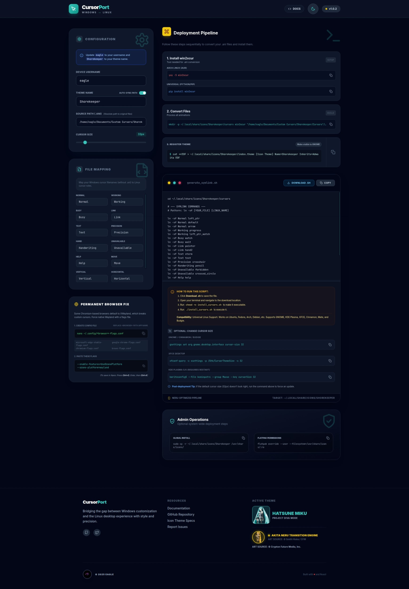
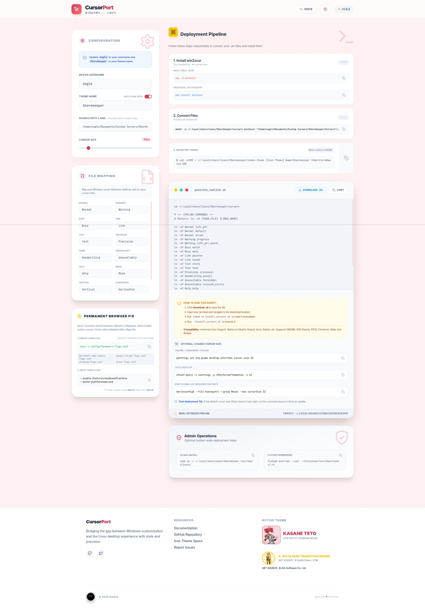

# CursorPort

**CursorPort** is a modern, web-based tool designed to bridge the gap between Windows and Linux customization. It allows users to easily convert and map Windows animated cursor schemes (`.ani`) into compliant Linux X11/Wayland cursor themes.


## 🌟 Features

- **Universal Linux Support**: Works on Arch, Ubuntu, Fedora, Debian, and more.
- **Desktop Environment Friendly**: Generates specific configuration commands for GNOME, KDE Plasma, and XFCE.
- **Visual Mapping**: Intuitive interface to map Windows cursor roles (e.g., "Working in Background") to Linux equivalents (e.g., `left_ptr_watch`).
- **One-Click Script Generation**: Instantly generates a shell script (`install_cursors.sh`) to handle symbolic linking and installation.
- **Themed UI**: Features a beautiful, responsive UI with "Miku" (Dark) and "Teto" (Light) themes, complete with transition animations.
- **Persistent Settings**: Automatically saves your paths, mappings, and preferences so you never lose your work.

## 🚀 Usage

**👉 [Click Here to Open CursorPort](https://eagle10021.github.io/Custom-Cursors-Linux/)**

No installation required! Just visit the website to start converting your cursors.

### How it Works
1.  **Open the Tool**: Visit the link above.
2.  **Configure**: Enter your settings and map your Windows `.ani` files.
3.  **Generate**: Download the generated shell script.
4.  **Run**: Execute the script on your Linux machine to apply the cursors.

## 🛠️ Prerequisites (For the actual conversion)

While the UI runs in the browser, the underlying conversion relies on the `win2xcur` tool.

**1. Install win2xcur:**
*   **Arch Linux (AUR):**
    ```bash
    yay -S win2xcur
    ```
*   **Universal (Pip):**
    ```bash
    pip install win2xcur
    ```

**2. Follow the Deployment Pipeline:**
Use the tool to generate your installation script, then follow the on-screen instructions to run it in your terminal.

## 📸 Gallery

<p align="center">
  
  
</p>

## 🎨 Creative Credits

*   **Dark Mode Muse:** Hatsune Miku V4X (Illustration by iXima)
*   **Light Mode Muse:** Kasane Teto SV (Illustration by Sakauchi Waka)
*   **Transition Engine:** Akita Neru (Design by Smith Hioka)

## 📄 License

This project is open-source. Feel free to modify and distribute.
